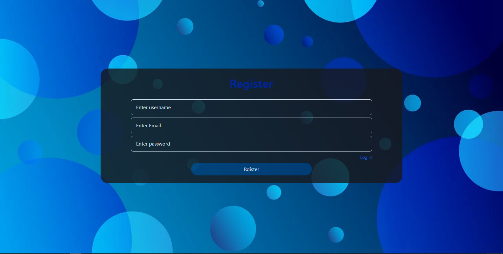
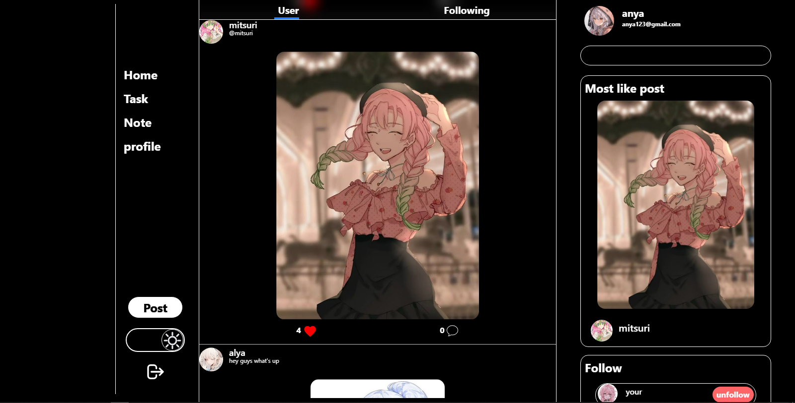
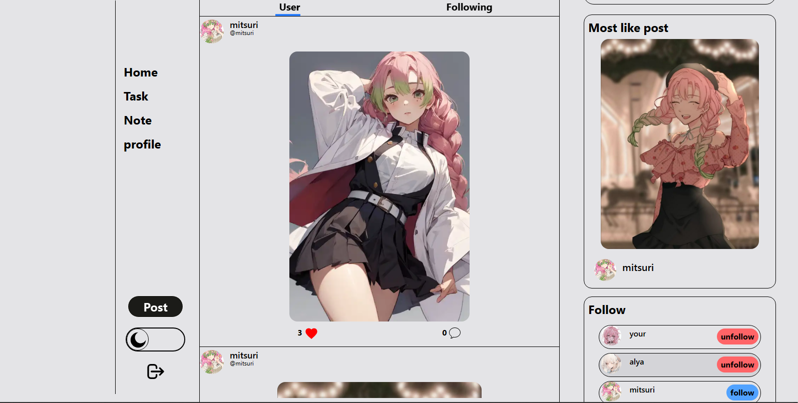
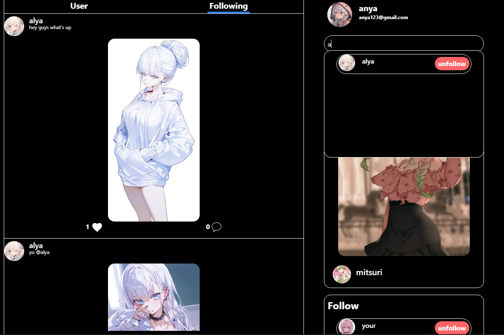
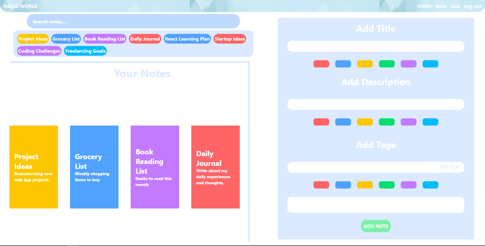
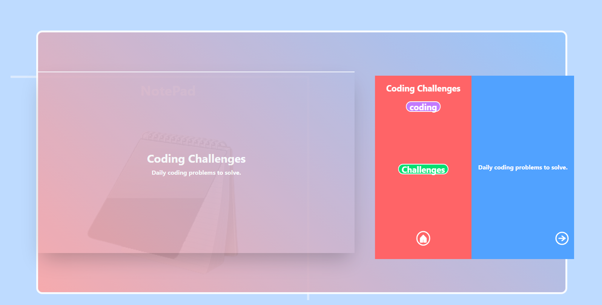
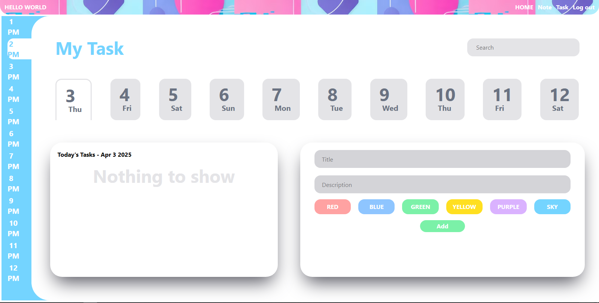
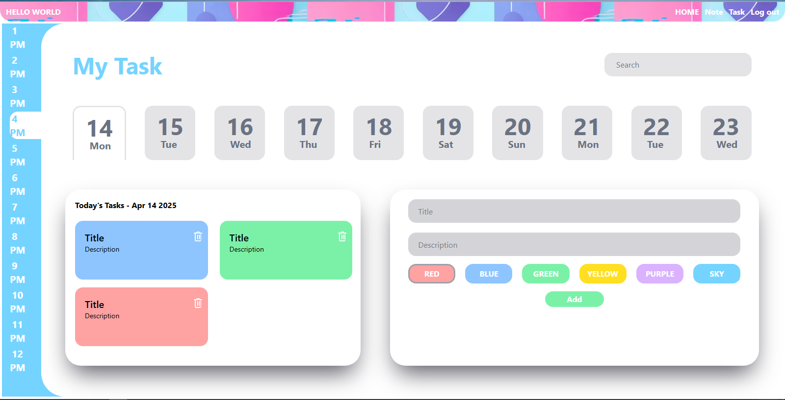

# 📱 FocusMeet

<div align="center">


**Your all-in-one productivity and social platform.**

FocusMeet is a full-stack MERN (MongoDB, Express, React, Node.js) web application that blends personal productivity tools with social networking features.

From writing notes, managing tasks, to connecting with others — FocusMeet keeps you in sync and focused.

[Features](#-key-features) • [Tech Stack](#-tech-stack) • [Screenshots](#-app-screenshots) • [Getting Started](#-getting-started)

</div>

---

## 🛠️ Tech Stack

### Frontend
-  **React.js** - UI Library
-  **Vite** - Build Tool
-  **Tailwind CSS** - Styling
-  **Axios** - HTTP Client

### Backend
-  **Node.js** - Runtime Environment
-  **Express.js** - Web Framework
-  **MongoDB** - Database
-  **Mongoose** - ODM

### Authentication & Security
-  **JWT** - Authentication
-  **Bcrypt** - Password Hashing
-  **Cookie Parser** - Cookie Management

### Development Tools
-  **Git** - Version Control
-  **VS Code** - IDE
-  **Postman** - API Testing

---

## 🔐 Authentication System

- Public Routes: Login, Register
- Private Routes: Home, Notes, Tasks
- Secure routes using JWT tokens and protected routing.

---

## 🌟 Key Features

### 👤 Authentication
- User registration & login
- Secure authentication using JWT

### 🏠 Home Page
- View all posts from users
- Dark mode / Light mode toggle
- Follow/unfollow users
- See only followed users' posts in the *Following* section
- Like and comment on posts
- Search and explore other users

### 📝 Notes Page
- Create, view, and delete notes
- Each note has:
  - Title, content, front & back colors
  - Tags (shown below the search bar)
  - Notebook-style viewer for opened notes
- Tag-based filtering and searching

### ✅ Task Page
- Create and manage daily tasks
- Add title, description, color, and date
- Tasks are timestamped and easily managed

---

## 🖼️ App Screenshots

### 📲 Login Page


### 🧾 Register Page


### 🏠 Home Page (Dark Mode)


### 🌞 Home Page (Light Mode)


### 👥 Following Section


### 🗒️ Note Page


### 📖 Note Open View


### 📋 Task Page


### ➕ Add Task


---

## 📌 Project Highlights

- Full-stack MERN architecture
- Custom authentication middleware
- Modern UI/UX with dark/light themes
- Organized routing (public vs private)
- Clean and scalable codebase

---

## 🚀 Getting Started

### Prerequisites
- Node.js (v14 or higher)
- MongoDB
- npm or yarn

### Installation

1. **Clone the repository**
```bash
[git clone https://github.com/yourusername/focusmeet-app.git](https://github.com/kirito666coder/FocusMeet-App.git)
cd focusmeet-app
```

2. **Install Backend Dependencies**
```bash
cd Backend
npm install
```

3. **Install Frontend Dependencies**
```bash
cd ../Frontend
npm install
```

4. **Environment Setup**
   - Create `.env` file in Backend directory
   - Add required environment variables:
   ```
   PORT=5000
   MONGODB_URI=your_mongodb_uri
   JWT_SECRET=your_jwt_secret
   ```

5. **Start the Application**
   - Start Backend:
   ```bash
   cd Backend
   npm i nodemon
   nodemon
   ```
   - Start Frontend:
   ```bash
   cd Frontend
   npm run dev
   ```

## 📝 License

This project is licensed under the MIT License - see the [LICENSE](LICENSE) file for details.

## 👥 Contributing

Contributions are welcome! Please feel free to submit a Pull Request.

1. Fork the project
2. Create your feature branch (`git checkout -b feature/AmazingFeature`)
3. Commit your changes (`git commit -m 'Add some AmazingFeature'`)
4. Push to the branch (`git push origin feature/AmazingFeature`)
5. Open a Pull Request

### 📬 Contact

- 📧 [kirito@gmail.com](kirito666codr@gmail.com)
- 💻 [GitHub: Kirito666codr](https://github.com/Kirito666codr)
- 🔗 [FocusMeet App](https://github.com/Kirito666codr/focusmeet-app)
