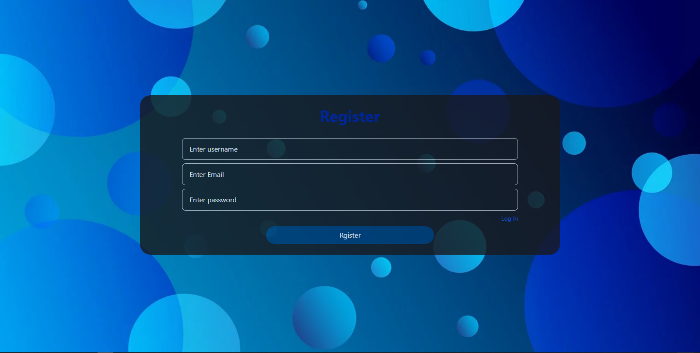
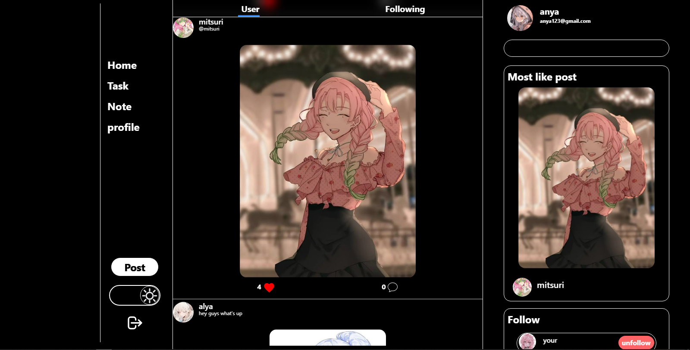
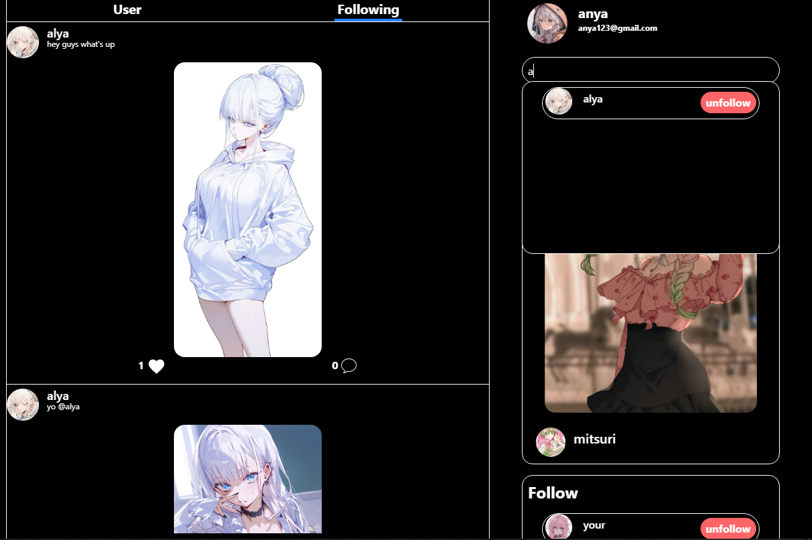
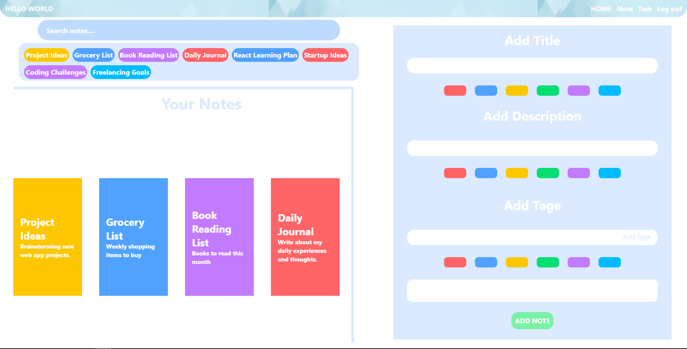
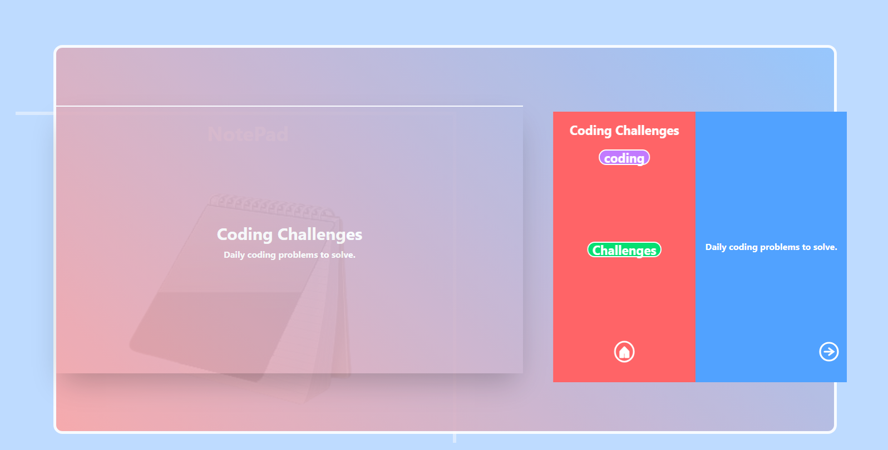
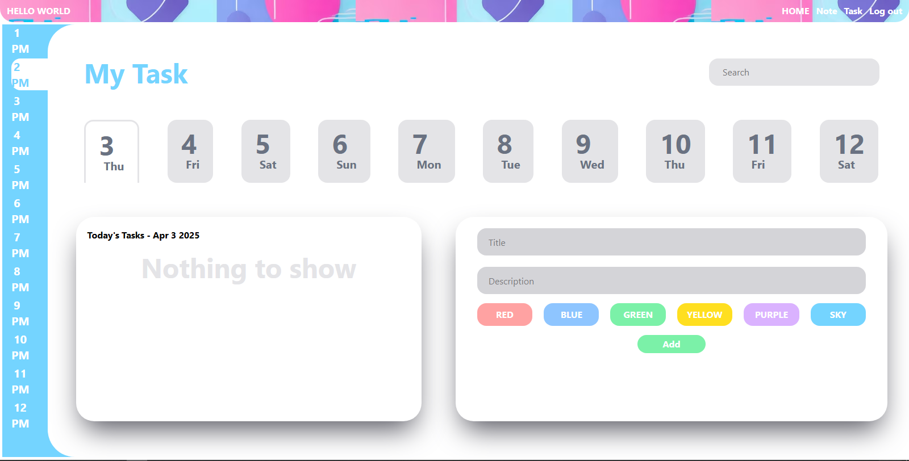

# 📱 FocusMeet

**Your all-in-one productivity and social platform.**

FocusMeet is a full-stack MERN (MongoDB, Express, React, Node.js) web application that blends personal productivity tools with social networking features.

From writing notes, managing tasks, to connecting with others — FocusMeet keeps you in sync and focused.

---

## 🔧 Tech Stack

- **Frontend**: React.js
- **Backend**: Node.js, Express.js
- **Database**: MongoDB
- **Authentication**: JWT, bcrypt, cookie-parser

---

## 🔐 Authentication System

- Public Routes: Login, Register
- Private Routes: Home, Notes, Tasks
- Secure routes using JWT tokens and protected routing.

---

## 🌟 Key Features

### 👤 Authentication
- User registration & login
- Secure authentication using JWT

### 🏠 Home Page
- View all posts from users
- Dark mode / Light mode toggle
- Follow/unfollow users
- See only followed users' posts in the *Following* section
- Like and comment on posts
- Search and explore other users

### 📝 Notes Page
- Create, view, and delete notes
- Each note has:
  - Title, content, front & back colors
  - Tags (shown below the search bar)
  - Notebook-style viewer for opened notes
- Tag-based filtering and searching

### ✅ Task Page
- Create and manage daily tasks
- Add title, description, color, and date
- Tasks are timestamped and easily managed

---

## 🖼️ App Screenshots

### 📲 Login Page

### 🧾 Register Page

### 🏠 Home Page (Dark Mode)

### 🌞 Home Page (Light Mode)

### 👥 Following Section

### 🗒️ Note Page

### 📖 Note Open View

### 📋 Task Page

### ➕ Add Task

---

## 📌 Project Highlights

- Full-stack MERN architecture
- Custom authentication middleware
- Modern UI/UX with dark/light themes
- Organized routing (public vs private)
- Clean and scalable codebase

---

## 🚀 Getting Started

1. **Clone the repository**
2. **Install dependencies**
   - Backend: `npm install`
   - Frontend: `npm install`
3. **Start development servers**
   - Backend: `nodemon`
   - Frontend: `npm run dev`
4. **Ensure MongoDB is running locally or use MongoDB Atlas`

---

## 🤝 Contribute

Pull requests are welcome! If you'd like to add features or fix bugs, feel free to fork and submit a PR.

---

## 📬 Contact

I'm currently in the learning phase — if you enjoyed this project, check out my other repos and feel free to leave a star ⭐ or open an issue to suggest improvements. Let's stay focused — together, on **FocusMeet** ✨